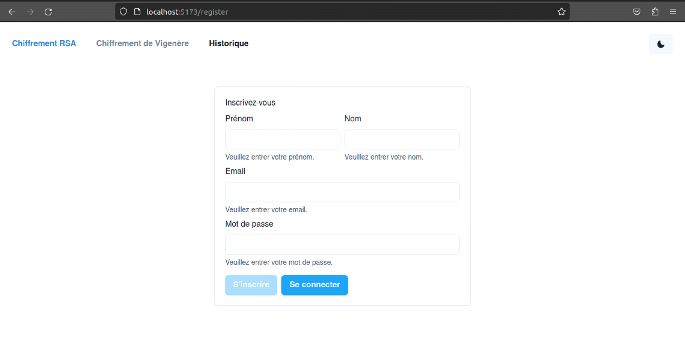
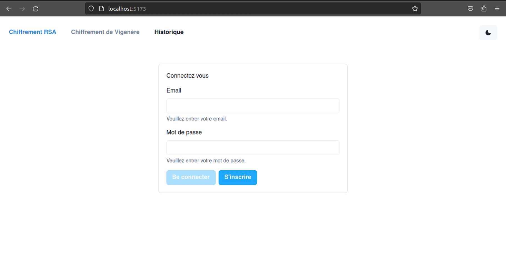
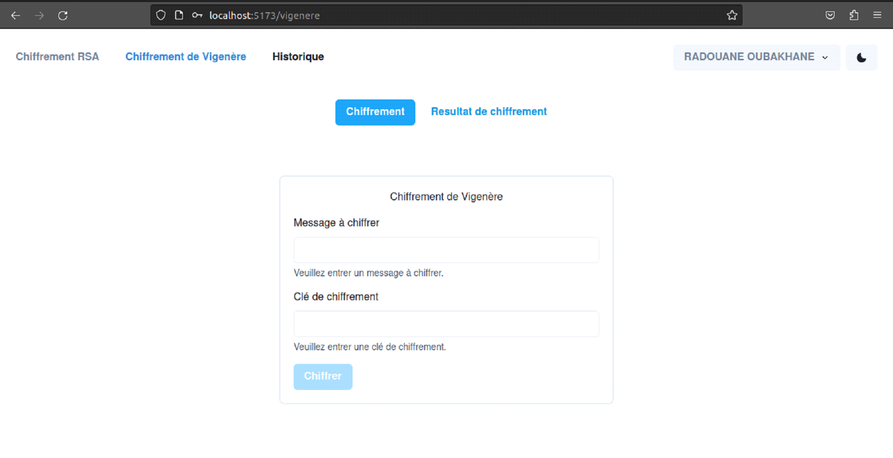
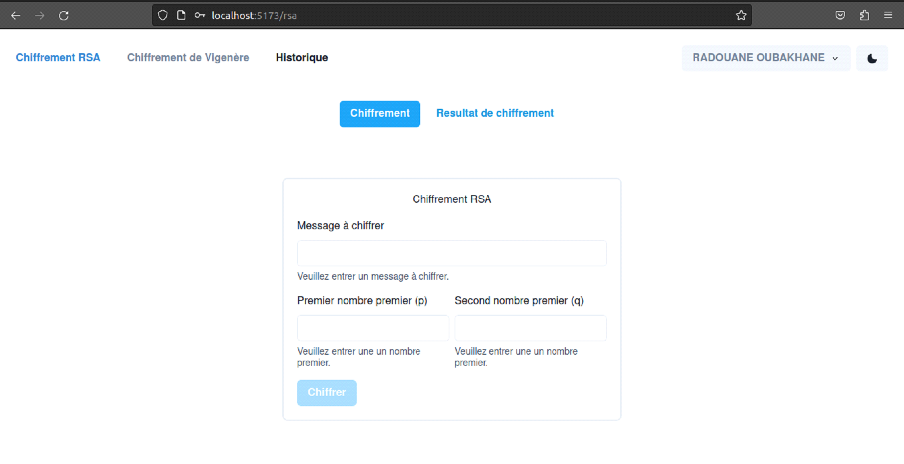
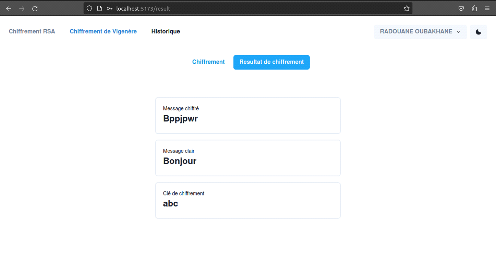
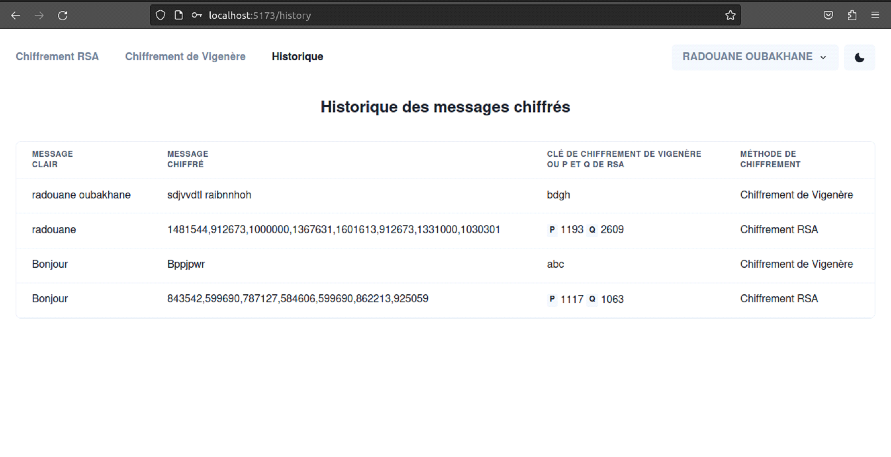

# Encryption Web Application
## Project Goals
The primary objective of this project was to develop a web application enabling users to log in, encrypt messages using diverse encryption methods, and securely store these encrypted messages in a database. Specific goals included:
- [x] Implementing a secure user authentication system.
- [x] Integrating two encryption methods: Vigenere cipher and RSA encryption.
- [x] Allowing users to store their encrypted messages in a database.
- [x] Establishing a historical section where users can review all previously encrypted messages.

## Technical Architecture
### Technologies Utilized
The application leverages a modern technology stack to ensure robustness and security. Here's an overview of the technical architecture employed in the development of the application:
- **TypeScript**:  Selected as the primary programming language for its static typing, enhancing code maintainability, and its compatibility with JavaScript for seamless integration with existing libraries.
- **React**:  A popular JavaScript library for creating interactive user interfaces, employing a component-based approach for efficient UI management and the development of reactive applications.
- **Chakra UI**:  A React component library that is both accessible and aesthetically pleasing, offering a set of ready-to-use components for creating consistent and attractive user interfaces.
- **Express and Node.js**:  Express.js, a minimal and flexible Node.js framework for building robust and performant server-side web applications. Node.js serves as the server-side runtime environment, providing efficiency for real-time and event-driven web applications.
- **MongoDB**:  A flexible and scalable NoSQL database used to store application data, ideal for handling unstructured or semi-structured data in modern web applications.

### Application Architecture
The architecture of the message encryption application follows the client-server model. Here's an overview of the technical architecture:
#### Client Frontend

- The user interface is developed using React.js and Chakra UI, ensuring an interactive user experience.
- TypeScript is employed for writing React components, ensuring typed and robust frontend code.

#### Server Backend
- Express.js is used to create a server-side RESTful API server, handling requests from the client.
- Node.js acts as the server-side runtime environment, enabling interaction with the MongoDB database and managing server-side operations.
- MongoDB serves as the primary database for storing encrypted messages and user information.

#### Frontend-Backend Communication
- The frontend communicates with the backend through RESTful HTTP requests for login, encryption, and accessing historical data.
- Data exchange occurs in JSON format, ensuring efficient communication between the two components of the application.

## Getting Started
### Prerequisites
- **Node.js**: Make sure you have Node.js installed on your system. You can download it from [nodejs.org](https://nodejs.org/).
- **MongoDB**: Make sure you have MongoDB installed on your system. You can download it from [mongodb.com](https://www.mongodb.com/try/download/community).
### Installation
1. Clone the repository.
```sh
git clone https://github.com/radouane-oubakhane/message-encoder.git
```
2. Change the working directory.
```sh
cd message-encoder
```
3. Change the working directory to the backend folder.
```sh
cd back-end
```
4. Install the required dependencies.
```sh
npm install
```
5. Start the backend server.
```sh
npm start
```
6. Open a new terminal and change the working directory to the frontend folder.
```sh
cd front-end
```
7. Install the required dependencies.
```sh
npm install
```
8. Start the frontend server.
```sh
npm run dev
```
9. Open your browser and navigate to [ http://localhost:5173]( http://localhost:5173) to access the application.

## Usage
### Register

### Login

### Encryption
#### Vigenere Cipher

#### RSA Encryption 

#### Encryption Results

### Historical Data


## Contributing
Contributions are welcome! Feel free to open an issue or submit a pull request.

